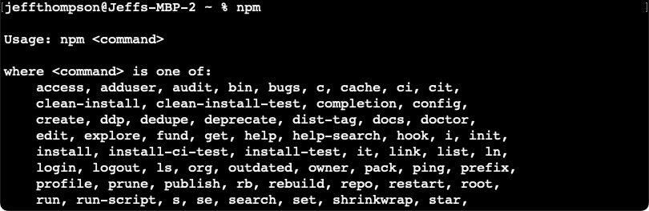
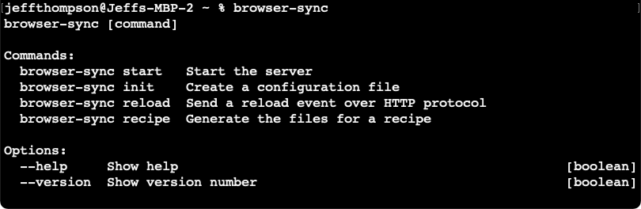
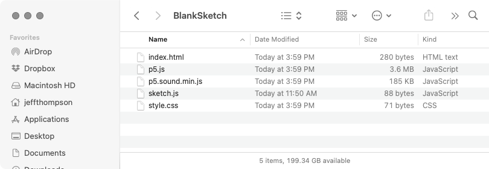
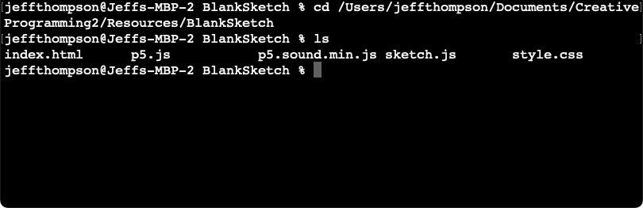
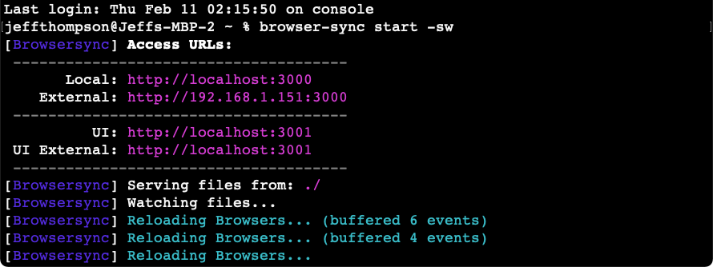

# USING AN EXTERNAL EDITOR

The `p5.js` online editor is awesome: it's a quick and easy way to start coding, it lets you share your projects easily, and it takes no effort to get it working. But it has some serious limitations too: everything has to fit on one screen, no auto-complete or color themes, and upload limits. Using a code editor locally on your computer does take some extra work but is well worth the time. Finding a workflow that's right for you can be an endless rabbit hole and this is just one way of working, but if you're just transitioning from the online editor this should help you get started. Experiment and see what works for you!

### CONTENTS
Jump ahead using these links or start from the beginning:

* [Text editor](https://github.com/jeffThompson/CreativeProgramming2/blob/master/Resources/UsingAnExternalEditor.md#text-editor)
* [Install Node and `npm`](https://github.com/jeffThompson/CreativeProgramming2/blob/master/Resources/UsingAnExternalEditor.md#node-and-npm)
* [Install `browser-sync`](https://github.com/jeffThompson/CreativeProgramming2/blob/master/Resources/UsingAnExternalEditor.md#install-browser-sync)
* [Project setup](https://github.com/jeffThompson/CreativeProgramming2/blob/master/Resources/UsingAnExternalEditor.md#project-setup)
* [Basic usage](https://github.com/jeffThompson/CreativeProgramming2/blob/master/Resources/UsingAnExternalEditor.md#basic-usage)
* [Mobile testing](https://github.com/jeffThompson/CreativeProgramming2/blob/master/Resources/UsingAnExternalEditor.md#mobile-testing)
* [FAQ](https://github.com/jeffThompson/CreativeProgramming2/blob/master/Resources/UsingAnExternalEditor.md#faq)

### TEXT EDITOR
First, you'll need a text editor. These can range from super simple, built-in programs like Text Edit or Notepad to incredibly complex development tools like Visual Studio or XCode. Between those extremes are solid, clean text editors that are designed for programming.

* [Sublime Text](https://www.sublimetext.com/3): free, lots of add-ons
* [Brackets](http://brackets.io/): open source, made by Adobe

If you don't already have a text editor, download either Sublime or Brackets; if you do have a preferred editor, just use that!

### NODE AND `npm`
Next, we need to install `node.js`. Node is based on Google's V8 Javascript engine, allowing you to do really cool things both online and offline! (It runs sites you probably use all the time like Netflix, Uber, and Paypal.) But we need Node so we can install it's "package manager" called `npm` (more on that in a sec).

1. Download [Node](https://nodejs.org/en/) for your operating system
2. Install on your computer

Now we need to check that `npm` is properly installed. Open your command line program:
* Mac: `Applications → Utilities → Terminal` (keep it in your dock too)
* Windows: `Start → Windows System → Command Prompt`
* Linux: you already know how to do this 😜

Type `npm` and hit return – you should see something like this:

`npm`, which stands for `Node Package Manager`, lets you install packages. Packages are tools and code libraries that extend the functionality of Node. Similar tools, like `pip` and `homebrew`, exist for other programming languages.

If the `npm` command worked, you're all set!

### INSTALL `browser-sync`
Next, we need to use `npm` to install [`browser-sync`](https://browsersync.io). All the work with Node was so we could install this tool; more on what it does next.

In your command line, type:

    npm install -g browser-sync

Some animated text will go by. When it's done, test that it worked by typing:

    browser-sync

You should see something similar to what you saw for `npm`:

### PROJECT SETUP
To use `browser-sync`, you'll need to have your project set up on your computer. The easiest way to do this is to grab a blank `p5.js` project here: https://github.com/jeffThompson/CreativeProgramming2/raw/master/Resources/BlankSketch.zip

Unzip it, then move the folder to wherever you're working! I suggest keeping a blank project ready and duplicating it, so you don't have to go through these steps every time.

You can also go to the `p5.js` Editor, create an empty sketch, save it, and go to `File → Download...` and save it to your computer.

The folder contains a few files:
* `sketch.js`: really the only file we care about – this is your project!
* `index.html`: the actual web page that displays your sketch
* `p5.js`: a local copy of the `p5.js` library
* `p5.sound.min.js`: the sound library; small but you can delete if your project doesn't have sound
* `style.css`: minimal stylesheet that controls how your webpage looks

If you have images, fonts, or other Javascript files, you can place them in your sketch folder too.

### BASIC USAGE
Ok, now we're all set! When working on your project, just follow these steps:

1. Open your command line program
2. Navigate to your project folder
  * Type `cd ` (note the space)
  * Drag your project folder into the Terminal wondow
  * You should see the full path to your project
  * Hit enter
  * You can see the contents of your folder with the command `ls` (Mac, Linux) or `dir` (Windows)

3. Type this command: `browser-sync start -s -w`
4. Your default browser should open and display your project!

5. To stop `browser-sync`:
  * Close your files and the tab with your project
  * In the command line, type `ctrl+c` – this should then return the prompt again

While `browser-sync` is running you can work on your project in your text editor. When you save a file, it should automatically reload the page in your browser – super nice!

### MOBILE TESTING
Ok, but what if you want to test your project on a mobile device? You could upload it to a server and open the page on your phone, refreshing every time you make a change. But what a pain! 

Luckily, there's another way:  
1. Make sure your mobile device and laptop are on the same wifi network
2. When launching `browser-sync`, notice the different urls that appear
3. The one labeled `External` should look something like this: `http://192.168.1.151:3000` &larr; notice it doesn't have `localhost` in it (this is an IP address, so it's more like a regular url than `localhost` which is accessible only to your computer)
4. Type that into your mobile browser (or send the tab via Airplay) – you should see your sketch
5. When you save your sketch, `browser-sync` will not only refresh the page on your computer but also your device!

There is one major flaw here: we can't see the Javascript console on the mobile device. This is super frustrating, I know. One way around it is to display whatever you would print in the console using `text()` in your sketch.

### FAQ
**Why bother with all this?**  
Two reasons! First, this makes local development easier, since it opens your project, auto-reloads, etc.

But, maybe more importantly, it solves the dreaded [*cross-origin* error](https://developer.mozilla.org/en-US/docs/Web/HTTP/CORS/Errors). Web browsers try their best to keep average users safe online, which is great. But recently, they have gotten super strict and don't allow you to load files from your own computer! Your sketch will run ok, but if you try to load an image or sound file, you get an annoying error.

There are a few ways around this (like disabling the feature in your browser) but they are risky when you're doing other things online. By using `browser-sync`, your browser sees everything like a normal website and won't give you any errors!

**What is that weird URL in my browser?**  
That's the address to files on your computer! In this case, `browser-sync` creates a local web server that behaves just like one online. This enables us to test stuff that requires a server and avoids some common pitfalls when working locally (see above).

As covered in the *Mobile Testing* section above, there are other ways of accessing your project.

**What are those words after the `browser-sync` command?**  
These are arguments, just like a function!

* `start` gets everything going
* `-s` means start a local web server
* `-w` means to watch the files and reload when you save

There are a ton more options when running `browser-sync`, but this is all we need to do our work! You can read about them all here: https://browsersync.io/docs/command-line

**What other tweaks to `browser-sync` might be helpful?**  
I would suggest adding the following:

* `--no-notify` removes the little popup in the upper-lefthand corner
* ~`--browser` lets you choose which browser to open, which is nice if you want to test with a browser other than your default~ I couldn't get this working, but maybe you can?

**What is the `-g` for when installing `browser-sync`?**  
It means that `browser-sync` will be installed globally on your computer. Some developers like to keep separate installs for different projects. This can avoid problems like one tool requiring an older version of another. Unless you're already doing this, it will be easiest to just install `browser-sync` globally and not worry about it.

### OTHER QUESTIONS?  
Have other questions? Let me know (by email or by creating an ["issue"](https://github.com/jeffThompson/CreativeProgramming2/issues/new) on this repository) and I can add them here!

